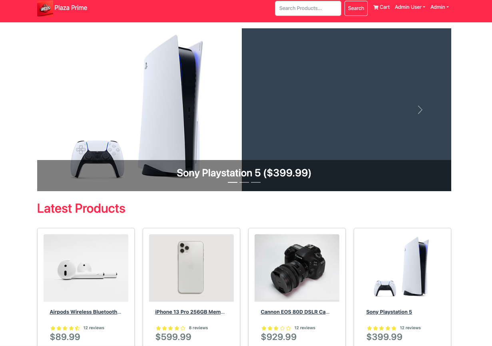
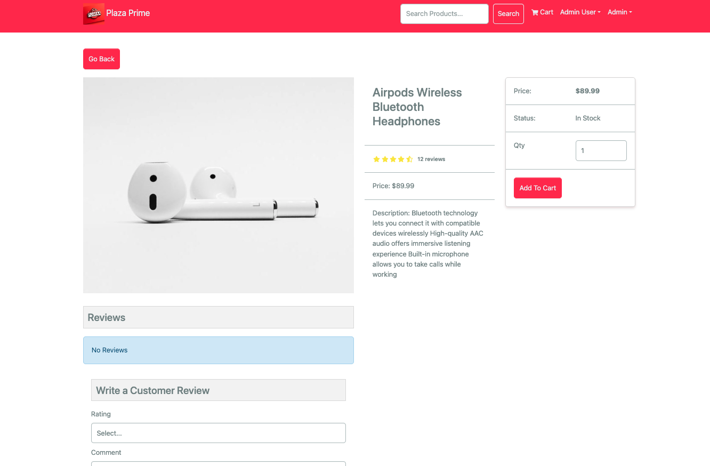
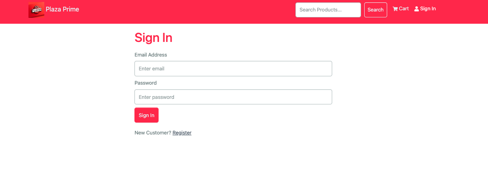
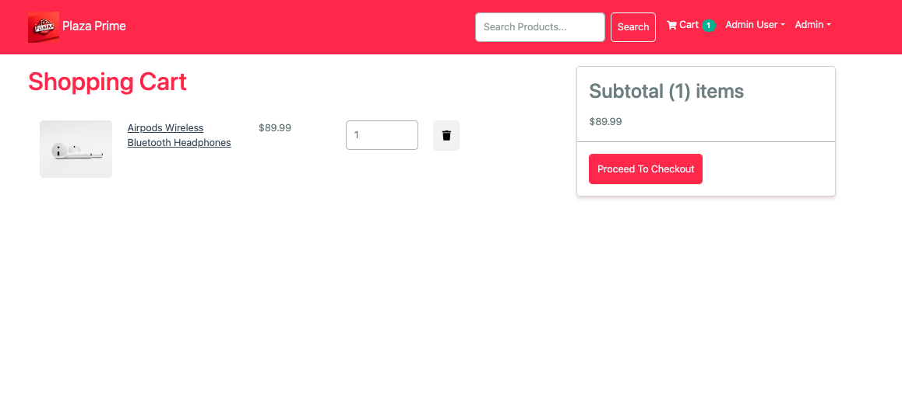
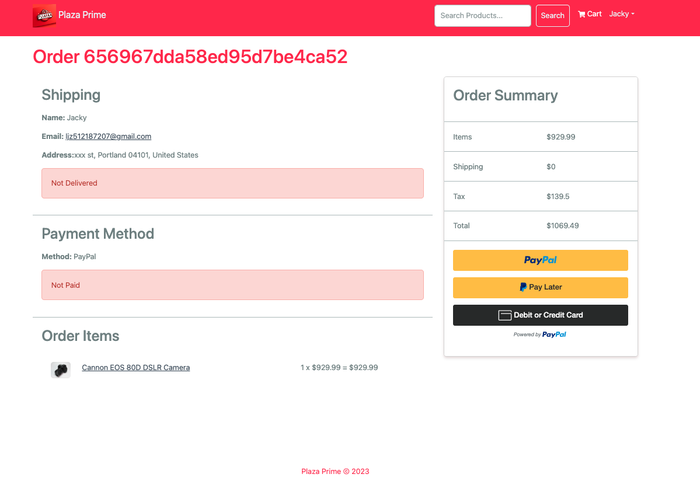
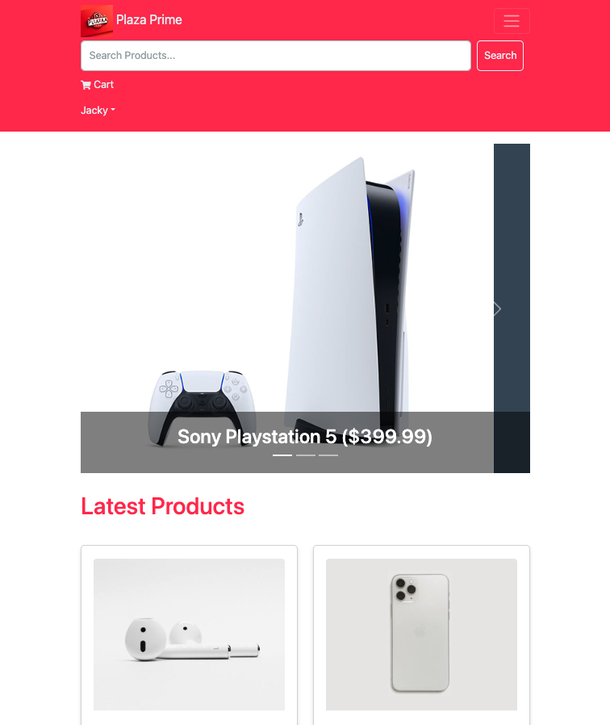
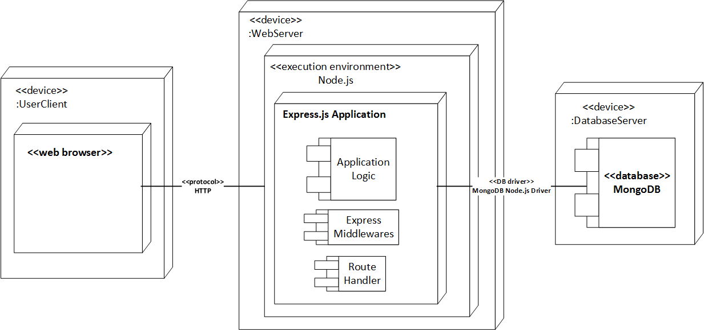

# Plaze Prime eCommerce Platform 

> eCommerce website built with the MERN stack & Redux.
>
> This full-stack project has been deployed, please visit the live version here: https://plaze-prime.onrender.com/


## Web Design Preview 

### Home Screen 



### Product Screen



### Login Screen



### Shopping Cart Screen



### Payment Screen 



### Responsive Design

#### Tablet Size:



#### Mobile Screen Size:


## Features

- Full featured shopping cart
- Product reviews and ratings
- Top products carousel
- Product pagination
- Product search feature
- User profile with orders
- Admin product management
- Admin user management
- Admin Order details page
- Mark orders as delivered option
- Checkout process (shipping, payment method, etc)
- PayPal / credit card integration
- Database seeder (products & users)

## Architecture Design Diagram 




## Quick Start

- Create a MongoDB database and obtain your `MongoDB URI` - [MongoDB Atlas](https://www.mongodb.com/cloud/atlas/register)
- Create a PayPal account and obtain your `Client ID` - [PayPal Developer](https://developer.paypal.com/)

### Env Variables

Add `.env` file and add the following

```
NODE_ENV = development
PORT = 5500
MONGO_URI = your mongodb uri
JWT_SECRET = 'abc123'
PAYPAL_CLIENT_ID = your paypal client id
PAGINATION_LIMIT = 8
```

Change the JWT_SECRET and PAGINATION_LIMIT to what you want

### Install Dependencies (frontend & backend)

```
npm install
cd frontend
npm install
```

### Run

```

# Run frontend (:3000) & backend (:5500) together
npm run dev

# Run backend only
npm run server
```


### Seed Database

Use the following commands to seed the database with some sample users and products as well as destroy all data

``` 
# Import data
npm run data:import

# Destroy data
npm run data:destroy
```


### Sample Users

> Please use bellow sample users to login

```
Sample User Logins

admin@email.com (Admin) # Admin can manage products and other users' info
123456

john@email.com (Customer)
123456

jane@email.com (Customer)
123456
```